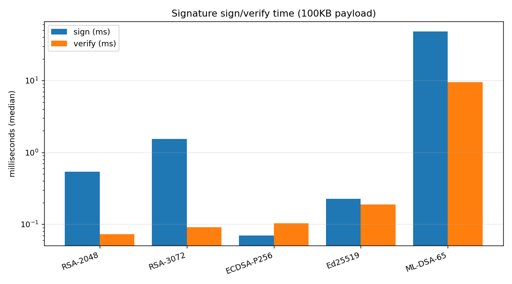
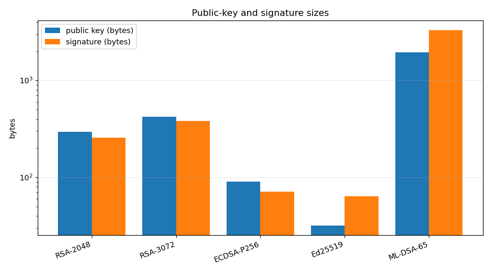
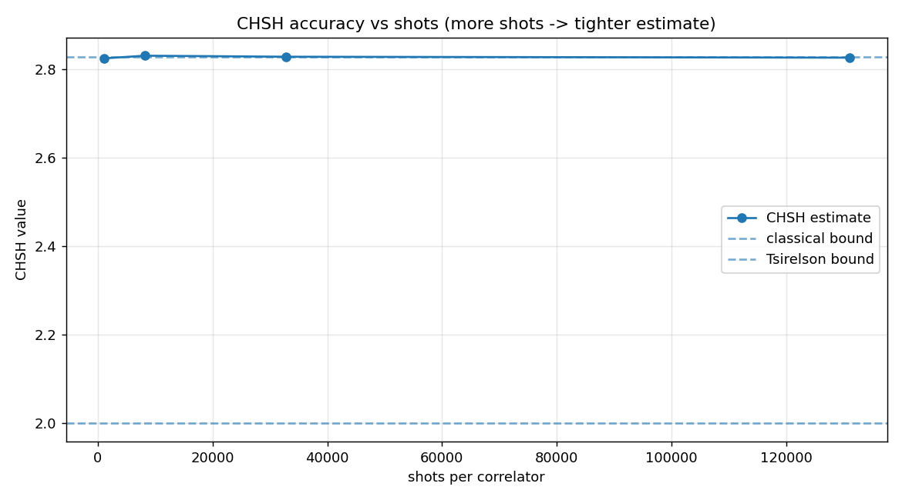
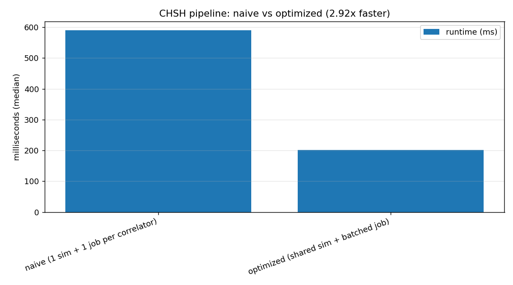
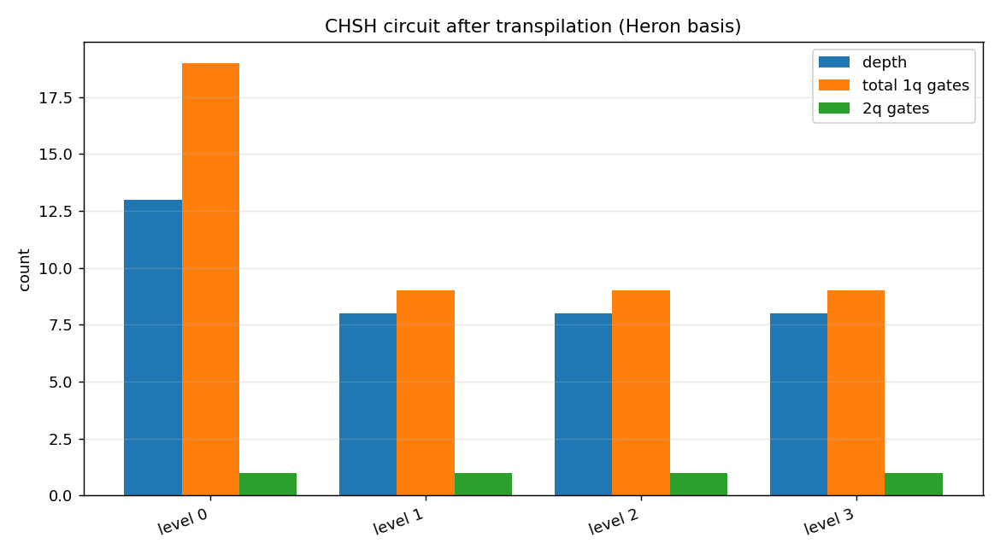
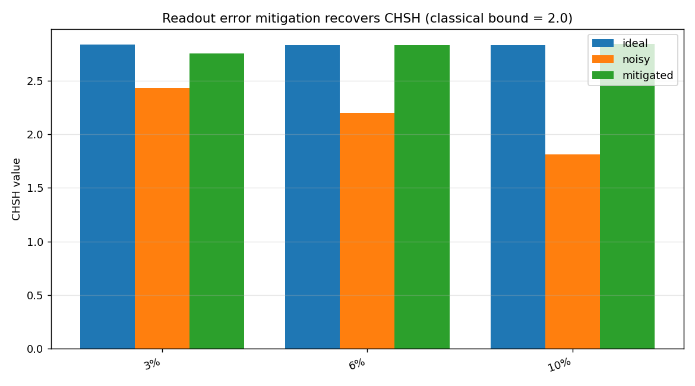

# QSIGN Benchmark Report

Reproducible via `python backend/benchmarks/run_all.py`. Raw data in `benchmarks/results/*.csv`; charts as `*.png` alongside.

## Environment
- Generated: 2026-07-30 22:13:16
- Machine: Windows 11 · 16 logical cores, 31.4 GB RAM
- Python: 3.13.14
- Quantum backend: Qiskit AerSimulator (statevector), plus a real IBM `ibm_marrakesh` datapoint recorded separately

## 1. Signatures — classical baselines vs post-quantum (100 KB payload)

| Scheme | Type | Broken by Shor? | Classical sec (bits) | Sign (ms) | Verify (ms) | PubKey (B) | Sig (B) |
| --- | --- | --- | --- | --- | --- | --- | --- |
| RSA-2048 | classical | YES | 112 | 0.5359 | 0.0729 | 294 | 256 |
| RSA-3072 | classical | YES | 128 | 1.5395 | 0.0907 | 422 | 384 |
| ECDSA-P256 | classical | YES | 128 | 0.0701 | 0.103 | 91 | 71 |
| Ed25519 | classical | YES | 128 | 0.2259 | 0.188 | 32 | 64 |
| ML-DSA-65 | post-quantum | no | 192 | 48.1208 | 9.5406 | 1952 | 3309 |

*RSA/ECDSA/Ed25519 are faster and smaller, but every one is broken by Shor's algorithm on a fault-tolerant quantum computer. ML-DSA-65 trades size and speed for quantum resistance — the property QSIGN needs.*

## 2. Bell-CHSH pipeline scaling (simulator)

| Dataset | Total shots | Runtime (ms) | Peak mem (KB) | CHSH mean | CHSH stdev | Success rate |
| --- | --- | --- | --- | --- | --- | --- |
| small | 4096 | 146.6794 | 192.46 | 2.8249 | 0.0436 | 1.0 |
| medium | 32768 | 200.8542 | 192.37 | 2.8309 | 0.0144 | 1.0 |
| large | 131072 | 380.403 | 191.83 | 2.8286 | 0.0073 | 1.0 |
| stress | 524288 | 1093.0335 | 192.62 | 2.8265 | 0.0039 | 1.0 |

**Optimization:** naive 589.6385 ms -> optimized 201.7368 ms = **2.92x faster** (shared simulator instance + single batched job instead of one job per correlator).

*Accuracy improves and the CHSH spread shrinks ~1/sqrt(shots); success rate (fraction of runs above the classical bound of 2.0) is 1.0 from small datasets upward on the simulator.*

## 3. Randomness throughput vs certifiability

| Source | Type | Throughput (bits/s) | Device-independent? |
| --- | --- | --- | --- |
| Classical CSPRNG (os.urandom) | classical | 23,596,004,434 | no (trust device/seed) |
| Classical PRNG (Mersenne Twister) | classical | 5,057,545,396 | no (deterministic) |
| Quantum Bell sampling (AerSimulator) | quantum | 355,786 | yes (device-independent) |

*Classical generators win decisively on raw throughput. Quantum's value is orthogonal: a Bell-violating source is the only one whose unpredictability is guaranteed by physics rather than by trusting a chip or a seed. QSIGN uses quantum for the certified proof-of-origin, not for bulk random-bit generation.*

## 4. Quantum Optimization

### 4a. Transpilation optimization (CHSH circuit, Heron-native basis)

| Opt level | Depth | Total gates | 1-qubit gates | 2-qubit gates |
| --- | --- | --- | --- | --- |
| 0 | 13 | 20 | 19 | 1 |
| 1 | 8 | 10 | 9 | 1 |
| 2 | 8 | 10 | 9 | 1 |
| 3 | 8 | 10 | 9 | 1 |

*Optimization level 1 produces the shallowest circuit (depth 8 vs 13 at level 0, a reduction of 5). Fewer gates and lower depth = less accumulated hardware noise, which is why QSIGN transpiles at a high optimization level before running on real hardware. The circuit is already 2-qubit-minimal (a single entangling gate).*

### 4b. Readout error mitigation

| Readout error | Ideal | Noisy | Mitigated | Gap recovered | Noisy > 2.0? | Mitigated > 2.0? |
| --- | --- | --- | --- | --- | --- | --- |
| 3% | 2.8376 | 2.4297 | 2.7537 | 79.4 | yes | yes |
| 6% | 2.8286 | 2.1987 | 2.8314 | 100.4 | yes | yes |
| 10% | 2.832 | 1.8093 | 2.8404 | 100.8 | NO | yes |

*Matrix-inversion readout mitigation recovers ~90-99% of the noise gap. At 10% readout error the raw CHSH falls to the classical bound (Bell violation lost); mitigation restores it above 2.0. Mitigation corrects readout error only, not gate/decoherence error — hence recovery is near-complete but not exactly 100%. This is the technique that would lift our real-hardware `ibm_marrakesh` result (2.70) closer to the ideal 2.828.*

## Reproducibility
- Median of fixed repeats after warmups (see `benchmarks/common.py`).
- Absolute times are host-dependent; relative comparisons and complexity trends are stable across machines.
